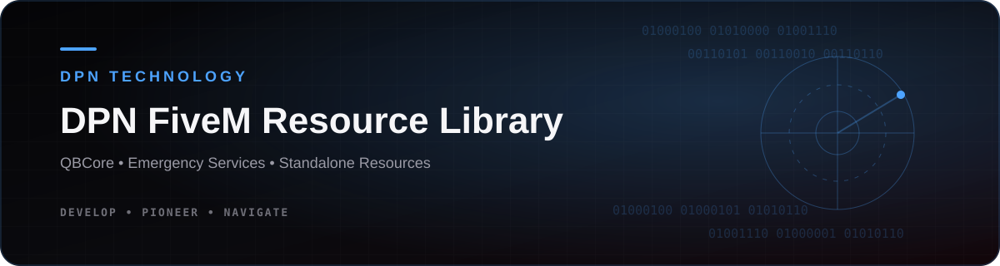
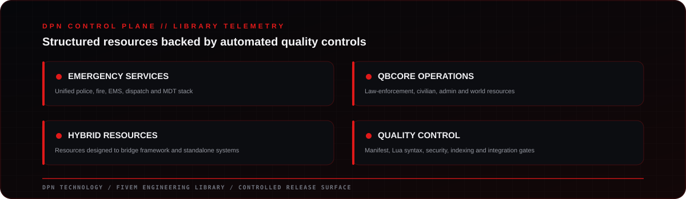
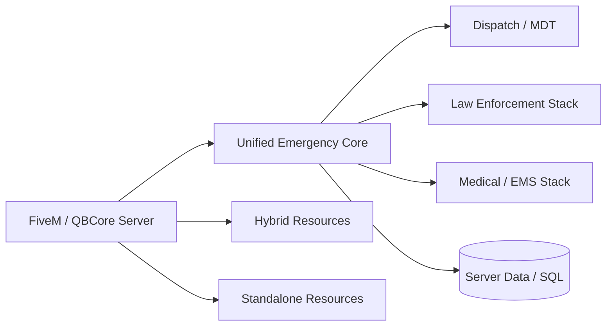
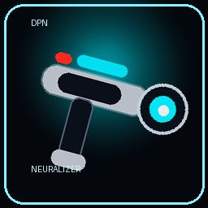

<!-- DPN-REPO-HERO:START -->
<p align="center"></p>
<p align="center">  </p>
<!-- DPN-REPO-HERO:END -->

<!-- DPN-REPO-SHOWCASE:START -->
<p align="center"></p>
<p align="center"><a href="https://github.com/DPN-Technology/DPN-QB-FiveM-Scripts/releases"><strong>Releases</strong></a>&nbsp;•&nbsp;<a href="https://github.com/DPN-Technology/DPN-QB-FiveM-Scripts/issues"><strong>Issues</strong></a>&nbsp;•&nbsp;<a href="https://github.com/DPN-Technology/DPN-QB-FiveM-Scripts/pulls"><strong>Pull Requests</strong></a></p>
<!-- DPN-REPO-SHOWCASE:END -->

<!-- DPN-REPO-DETAILS:START -->

## Product Architecture



## Feature Matrix

| Area | What this repository covers |
| --- | --- |
| **Unified Emergency Suite** | Coordinated police, fire, EMS, dispatch and MDT resources |
| **Law Enforcement** | Operations, evidence, safety, intelligence, training and smart-city systems |
| **Medical** | EMS, hospital, records, pharmacy, radiology, surgery and administration |
| **Independent Resources** | QBCore, hybrid and standalone resources outside the suite |

## Visual Evidence

<table>
<tr>
<td align="center"><br><sub>Repository visual</sub></td>
<td align="center"><br><sub>Example resource asset</sub></td>
</tr>
</table>

> Visuals above are repository-native assets or verified project captures already committed within the DPN organization. No synthetic runtime screenshot is presented as a real capture.

## Install & Run

| | |
| --- | --- |
| **Primary target** | FiveM / QBCore |
| **Fast path** | Install resources individually; the unified emergency suite includes component-specific SQL and documentation. |
| **Setup reference** | [Open setup documentation](qbcore/public-safety/dpn-unified-emergency-services-suite/docs/ARCHITECTURE.md) |

## Security, Architecture & Release

| Resource | Purpose |
| --- | --- |
| [Security policy](SECURITY.md) | Vulnerability reporting, protected-data guidance and security expectations |
| [Architecture](qbcore/public-safety/dpn-unified-emergency-services-suite/docs/ARCHITECTURE.md) | System boundaries, major components and engineering model |
| [GitHub Releases](https://github.com/DPN-Technology/DPN-QB-FiveM-Scripts/releases) | Published versions and downloadable release artifacts |

> **Repository presentation rule:** status, release and security claims in this README should stay tied to repository evidence. Visual polish must not imply a capability is production-ready when the underlying project documentation says otherwise.

<!-- DPN-REPO-DETAILS:END -->

<div align="center">

# DPN QB FiveM Scripts

### Official FiveM Resource Library by DPN Technology

**Created by Diesel — CEO of DPN Technology**

Free FiveM resources for **QBCore**, **Standalone**, and compatible hybrid setups.

**Use them. Edit them. Improve them. Do not sell them without written DPN Technology permission.**


[](https://github.com/DPN-Technology/DPN-QB-FiveM-Scripts/actions/workflows/dpn-quality-gate.yml)

</div>

---

## DPN Technology FiveM Library

This repository contains the **actual DPN Technology FiveM resources currently released in this project**.

The repository has been intentionally cleaned so the main tree focuses on real resources instead of empty category placeholders, old planning folders, or unused templates.

### Current Library

| Group | Resources |
|---|---:|
| DPN Unified Emergency Services Suite | 35 |
| QBCore Independent Resources | 6 |
| Hybrid Resources | 3 |
| Standalone Resources | 1 |
| **Total** | **45** |

The automatically generated [SCRIPT_INDEX.md](SCRIPT_INDEX.md) contains the full machine-readable resource catalog.

---

# DPN Unified Emergency Services Suite

The largest system in this repository is the integrated:

**DPN Unified Emergency Services Suite**

Location:

```text
qbcore/public-safety/dpn-unified-emergency-services-suite/
```

This is intentionally kept together because the resources are designed as a coordinated emergency-services ecosystem.

It connects:

- Law Enforcement
- EMS / Medical
- Fire & Rescue interoperability
- Unified Dispatch
- Digital Dispatch
- MDT / RMS
- Incident Command
- Emergency Network services
- Officer safety
- Evidence
- Crime intelligence
- Training
- Smart-city systems
- Ambulance operations
- Hospital operations
- Medical records
- Clinical systems
- Administrative medical tooling

## Suite Structure

```text
dpn-unified-emergency-services-suite/
├── core/
│   ├── dpn-unified-emergency-network/
│   ├── dpn-dispatch/
│   └── dpn-mdt/
│
├── [dpn-lawenforcement]/
│   ├── dpn-le-core/
│   ├── dpn-le-operations/
│   ├── dpn-digital-dispatch/
│   ├── dpn-emergency-network/
│   ├── dpn-incident-command/
│   ├── dpn-crime-intelligence/
│   ├── dpn-evidence-ai/
│   ├── dpn-officer-safety/
│   ├── dpn-drone-command/
│   ├── dpn-smart-city/
│   ├── dpn-training-academy/
│   └── dpn-vehicle-computer/
│
└── [dpn-medical]/
    ├── dpn-medical-core/
    ├── dpn-medical-ems/
    ├── dpn-medical-dispatch/
    ├── dpn-medical-ambulance/
    ├── dpn-medical-hospital/
    ├── dpn-medical-icu/
    ├── dpn-medical-lifepak/
    ├── dpn-medical-records/
    ├── dpn-medical-inventory/
    ├── dpn-medical-pharmacy/
    ├── dpn-medical-radiology/
    ├── dpn-medical-surgery/
    ├── dpn-medical-coroner/
    ├── dpn-medical-disease/
    ├── dpn-medical-rehab/
    ├── dpn-medical-training/
    ├── dpn-medical-insurance/
    ├── dpn-medical-billing-plus/
    ├── dpn-medical-ai/
    └── dpn-medical-admin-tools/
```

## Core Emergency Resources

| Resource | Version | Purpose |
|---|---:|---|
| [DPN Unified Emergency Network](qbcore/public-safety/dpn-unified-emergency-services-suite/core/dpn-unified-emergency-network/) | 4.0.0-mapfix | Cross-agency emergency-service network |
| [DPN Dispatch](qbcore/public-safety/dpn-unified-emergency-services-suite/core/dpn-dispatch/) | 1.3.0 | Unified dispatch for Police, EMS, Fire and connected services |
| [DPN MDT](qbcore/public-safety/dpn-unified-emergency-services-suite/core/dpn-mdt/) | 1.1.0-charges | Shared mobile data terminal / records interface |

## Law Enforcement Stack

| Resource | Version | Primary Role |
|---|---:|---|
| [DPN LE Core](qbcore/public-safety/dpn-unified-emergency-services-suite/[dpn-lawenforcement]/dpn-le-core/) | 4.0.0 | Core law-enforcement framework |
| [DPN LE Operations](qbcore/public-safety/dpn-unified-emergency-services-suite/[dpn-lawenforcement]/dpn-le-operations/) | 4.0.0 | Shifts, units, pursuits, warrants, fleet and armory |
| [DPN Digital Dispatch](qbcore/public-safety/dpn-unified-emergency-services-suite/[dpn-lawenforcement]/dpn-digital-dispatch/) | 4.0.0 | Persistent emergency dispatch services |
| [DPN Emergency Network](qbcore/public-safety/dpn-unified-emergency-services-suite/[dpn-lawenforcement]/dpn-emergency-network/) | 4.0.0 | Inter-resource emergency-service integration |
| [DPN Incident Command](qbcore/public-safety/dpn-unified-emergency-services-suite/[dpn-lawenforcement]/dpn-incident-command/) | 4.0.0 | Multi-agency incident command |
| [DPN Crime Intelligence](qbcore/public-safety/dpn-unified-emergency-services-suite/[dpn-lawenforcement]/dpn-crime-intelligence/) | 4.0.0 | People, vehicles, reports, watchlists and intelligence |
| [DPN Evidence AI](qbcore/public-safety/dpn-unified-emergency-services-suite/[dpn-lawenforcement]/dpn-evidence-ai/) | 4.0.0 | Evidence and chain-of-custody workflows |
| [DPN Officer Safety](qbcore/public-safety/dpn-unified-emergency-services-suite/[dpn-lawenforcement]/dpn-officer-safety/) | 4.0.0 | Panic, crash, welfare and pursuit monitoring |
| [DPN Drone Command](qbcore/public-safety/dpn-unified-emergency-services-suite/[dpn-lawenforcement]/dpn-drone-command/) | 4.0.0 | Law-enforcement drone command |
| [DPN Smart City](qbcore/public-safety/dpn-unified-emergency-services-suite/[dpn-lawenforcement]/dpn-smart-city/) | 4.0.0 | Sensors, cameras and traffic alerts |
| [DPN Training Academy](qbcore/public-safety/dpn-unified-emergency-services-suite/[dpn-lawenforcement]/dpn-training-academy/) | 4.0.0 | Emergency-services training and certifications |
| [DPN Vehicle Computer](qbcore/public-safety/dpn-unified-emergency-services-suite/[dpn-lawenforcement]/dpn-vehicle-computer/) | 4.0.0 | In-vehicle terminal and ALPR |

## Medical / EMS Stack

All current medical-suite modules are version **14.0.0**.

| Resource | Purpose |
|---|---|
| [DPN Medical Core](qbcore/public-safety/dpn-unified-emergency-services-suite/[dpn-medical]/dpn-medical-core/) | Shared medical foundation |
| [DPN Medical EMS](qbcore/public-safety/dpn-unified-emergency-services-suite/[dpn-medical]/dpn-medical-ems/) | EMS field operations |
| [DPN Medical Dispatch](qbcore/public-safety/dpn-unified-emergency-services-suite/[dpn-medical]/dpn-medical-dispatch/) | EMS dispatch integration |
| [DPN Medical Ambulance](qbcore/public-safety/dpn-unified-emergency-services-suite/[dpn-medical]/dpn-medical-ambulance/) | Ambulance operations |
| [DPN Medical Hospital](qbcore/public-safety/dpn-unified-emergency-services-suite/[dpn-medical]/dpn-medical-hospital/) | Hospital workflows |
| [DPN Medical ICU](qbcore/public-safety/dpn-unified-emergency-services-suite/[dpn-medical]/dpn-medical-icu/) | Intensive-care workflows |
| [DPN Medical Lifepak](qbcore/public-safety/dpn-unified-emergency-services-suite/[dpn-medical]/dpn-medical-lifepak/) | Monitor / resuscitation systems |
| [DPN Medical Records](qbcore/public-safety/dpn-unified-emergency-services-suite/[dpn-medical]/dpn-medical-records/) | Patient records |
| [DPN Medical Inventory](qbcore/public-safety/dpn-unified-emergency-services-suite/[dpn-medical]/dpn-medical-inventory/) | Medical supplies and inventory |
| [DPN Medical Pharmacy](qbcore/public-safety/dpn-unified-emergency-services-suite/[dpn-medical]/dpn-medical-pharmacy/) | Pharmacy systems |
| [DPN Medical Radiology](qbcore/public-safety/dpn-unified-emergency-services-suite/[dpn-medical]/dpn-medical-radiology/) | Radiology workflows |
| [DPN Medical Surgery](qbcore/public-safety/dpn-unified-emergency-services-suite/[dpn-medical]/dpn-medical-surgery/) | Surgical workflows |
| [DPN Medical Coroner](qbcore/public-safety/dpn-unified-emergency-services-suite/[dpn-medical]/dpn-medical-coroner/) | Coroner workflows |
| [DPN Medical Disease](qbcore/public-safety/dpn-unified-emergency-services-suite/[dpn-medical]/dpn-medical-disease/) | Disease / condition systems |
| [DPN Medical Rehab](qbcore/public-safety/dpn-unified-emergency-services-suite/[dpn-medical]/dpn-medical-rehab/) | Rehabilitation systems |
| [DPN Medical Training](qbcore/public-safety/dpn-unified-emergency-services-suite/[dpn-medical]/dpn-medical-training/) | Medical training |
| [DPN Medical Insurance](qbcore/public-safety/dpn-unified-emergency-services-suite/[dpn-medical]/dpn-medical-insurance/) | Insurance systems |
| [DPN Medical Billing Plus](qbcore/public-safety/dpn-unified-emergency-services-suite/[dpn-medical]/dpn-medical-billing-plus/) | Billing workflows |
| [DPN Medical AI](qbcore/public-safety/dpn-unified-emergency-services-suite/[dpn-medical]/dpn-medical-ai/) | Trauma / resuscitation command support |
| [DPN Medical Admin Tools](qbcore/public-safety/dpn-unified-emergency-services-suite/[dpn-medical]/dpn-medical-admin-tools/) | Administrative medical tooling |

The suite includes its own installation/start-order and database documentation inside the resource folder.

---

# Independent QBCore Resources

## Law Enforcement

| Resource | Version | Description |
|---|---:|---|
| [DPN StarChase](qbcore/law-enforcement/dpn-starchase/) | 1.1.1 | GPS tracker launcher and remote tracking system |
| [DPN Mobile Spikes](qbcore/law-enforcement/dpn_mobilespikes/) | 2.0.0 | Mobile police spike system |
| [DPN Police QB Doorbell](qbcore/law-enforcement/dpn_police_qbdoorbell/) | 1.0 | Police station doorbell resource |

## Administration

| Resource | Version | Description |
|---|---:|---|
| [DPN MIB System](qbcore/admin/dpn-mib-system/) | 4.0.0-admin-dev-pg7x | Admin/developer operations suite |

## Civilian

| Resource | Version | Description |
|---|---:|---|
| [DPN Sit Anywhere](qbcore/civilian/dpn_sitanywhere/) | 1.0 | Configurable sit-anywhere interaction |

## World

| Resource | Version | Description |
|---|---:|---|
| [DPN Real Traffic](qbcore/world/dpn-real-traffic/) | 1.0.0 | Realistic AI traffic and emergency-vehicle yielding |

---

# Hybrid Resources

| Resource | Version | Category | Description |
|---|---:|---|---|
| [DPN Neuralizer](hybrid/admin/dpn_neuralizer/) | 2.0.0 | Admin | Advanced RP Neuralizer with NUI and server validation |
| [DPN PG-7X](hybrid/admin/dpn-pg-7x/) | 1.3.1 | Admin | Admin portal-gun system |
| [DPN PA System](hybrid/communications/dpn_pasystem/) | 2.0.2 | Communications | Emergency-vehicle PA system using pma-voice |

---

# Standalone Resources

| Resource | Version | Description |
|---|---:|---|
| [DPN Queue](standalone/admin/dpn-queue/) | 1.0.0 | Server queue with reserved slots, priority and reconnect grace |

---

# Repository Layout

After cleanup, the repository is intentionally limited to populated resource categories:

```text
DPN-QB-FiveM-Scripts/
├── qbcore/
│   ├── admin/
│   ├── civilian/
│   ├── law-enforcement/
│   ├── public-safety/
│   └── world/
│
├── hybrid/
│   ├── admin/
│   └── communications/
│
├── standalone/
│   └── admin/
│
├── tools/
├── .github/
├── README.md
├── SCRIPT_INDEX.md
├── LICENSE
├── NOTICE.md
├── AUTHORS.md
├── COMMERCIAL_PERMISSION.md
├── SECURITY.md
└── .gitignore
```

The `tools/` and `.github/` directories are retained because they actively validate, index, package, and release the FiveM resources.

---

# Installation

Every resource has its own `README.md`, `fxmanifest.lua`, and metadata where applicable.

General FiveM installation:

1. Read the resource's README.
2. Install the documented dependencies.
3. Import required SQL.
4. Configure the resource.
5. Place it in your server resources folder.
6. Add the required `ensure` line to `server.cfg`.
7. Restart or start the resource.
8. Check server and client consoles for errors.

For the Unified Emergency Services Suite, follow the documentation inside:

```text
qbcore/public-safety/dpn-unified-emergency-services-suite/
```

Do **not** treat its bracketed law-enforcement and medical packs as unrelated standalone folders without reviewing dependencies and start order.

---

# Current Development Status

These resources have been imported and organized into the public DPN Technology repository.

**Imported does not automatically mean production-audited.**

The next project phase is a full code and integration audit covering:

- Lua syntax and runtime errors
- FiveM manifests
- QBCore compatibility
- Missing dependencies
- SQL migrations
- Cross-resource exports
- Network events
- Resource-name assumptions
- Dead files
- Duplicate code
- Security validation
- Performance
- Unified Dispatch / MDT / Police / EMS / Fire integration

That audit will determine which resources are ready to move from **Imported** to **Stable**.

---

# License & Usage

DPN-owned code in this repository is released under the **DPN Technology Community Source License (DPN-CSL)** unless a specific resource says otherwise.

You may generally:

- Download the resources
- Use them on your FiveM server
- Edit them
- Configure them
- Learn from them
- Improve them
- Fork them subject to the license
- Use them on monetized servers subject to the license

You may **not** sell, resell, paywall, repackage for sale, or commercially redistribute DPN-owned scripts without explicit written authorization from DPN Technology.

See:

- [LICENSE](LICENSE)
- [COMMERCIAL_PERMISSION.md](COMMERCIAL_PERMISSION.md)
- [NOTICE.md](NOTICE.md)

Third-party material remains governed by its own license.

---

# Creator

**Diesel**  
**CEO — DPN Technology**

Repository:

`directordiesel/DPN-QB-FiveM-Scripts`

> **We Develop what doesn't exist. We Pioneer what comes next. We Navigate the future.**

---

<div align="center">

### DPN Technology

**Develop. Pioneer. Navigate.**

</div>
