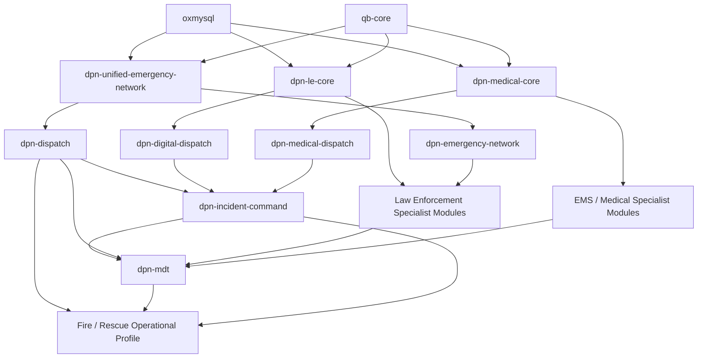

# DPN Unified Emergency Services — FiveM Deployment Topology

## Source Repository Layout vs. Runtime Layout

**Created by Diesel — CEO of DPN Technology**

The GitHub repository is organized for source management and documentation. The directory `dpn-unified-emergency-services-suite` is a **container for many FiveM resources**; it is not itself a FiveM resource because it does not have a root `fxmanifest.lua`.

For deployment, copy the actual resource directories into your FiveM server's `resources/` tree.

## Recommended Runtime Layout

A clean deployment layout is:

```text
resources/
├── [dpn-public-safety-core]/
│   ├── dpn-unified-emergency-network/
│   ├── dpn-dispatch/
│   └── dpn-mdt/
│
├── [dpn-lawenforcement]/
│   ├── dpn-le-core/
│   ├── dpn-digital-dispatch/
│   ├── dpn-emergency-network/
│   ├── dpn-incident-command/
│   ├── dpn-crime-intelligence/
│   ├── dpn-evidence-ai/
│   ├── dpn-officer-safety/
│   ├── dpn-drone-command/
│   ├── dpn-smart-city/
│   ├── dpn-training-academy/
│   ├── dpn-vehicle-computer/
│   └── dpn-le-operations/
│
└── [dpn-medical]/
    ├── dpn-medical-core/
    ├── dpn-medical-ems/
    ├── dpn-medical-dispatch/
    ├── dpn-medical-ambulance/
    ├── dpn-medical-hospital/
    └── ...remaining medical modules...
```

The bracket folders are organizational groups. The actual runtime resources are the child directories that contain `fxmanifest.lua`.

## Do Not Rename Resources During Deployment

Resource names are part of the runtime contract.

Renaming can break:

- `dependency` declarations
- `ensure` statements
- `exports['resource-name']`
- `GetResourceState()`
- inter-resource events
- NUI/resource URLs
- scripts that dynamically reference another resource by name

Legacy `dpn_` names elsewhere in the repository are also preserved for this reason.

## Startup Order

Do not rely on directory alphabetic order.

Copy the entries from [START_ORDER.cfg](../START_ORDER.cfg) into your server configuration in the documented sequence.

The high-level order is:

```text
oxmysql
qb-core
    ↓
DPN shared emergency-network cores
    ↓
law + medical domain cores
    ↓
dispatch / incident command / MDT
    ↓
law-enforcement specialist modules
    ↓
medical / EMS specialist modules
```

## Conceptual Dependency Graph



This graph is a conceptual platform map. Individual `fxmanifest.lua`, README, configuration and SQL requirements remain authoritative for specific module dependencies.

## Fire / Rescue

The uploaded collection has no dedicated `[dpn-fire]` runtime bundle. Fire/Rescue currently participates through the shared:

- Dispatch
- MDT
- Unified Emergency Network
- Emergency Network
- Incident Command
- EMS/medical rescue workflow

See [Fire & Rescue Integration](../departments/fire-rescue/README.md).

## Database

Review [DATABASE_INSTALL.md](DATABASE_INSTALL.md) before importing SQL.

A clean resources folder does **not** mean the database is clean. Existing schemas from earlier DPN versions or other emergency-service scripts may conflict.

## Production Recommendation

Build this first on a development server.

Validate one integrated incident from call creation through dispatch, law/EMS/fire assignment, incident command, MDT visibility, patient transport and records persistence before deploying the full suite to production.

---

**DPN Technology — Develop Pioneer Navigate**

*We Develop what doesn't exist. We Pioneer what comes next. We Navigate the future.*
